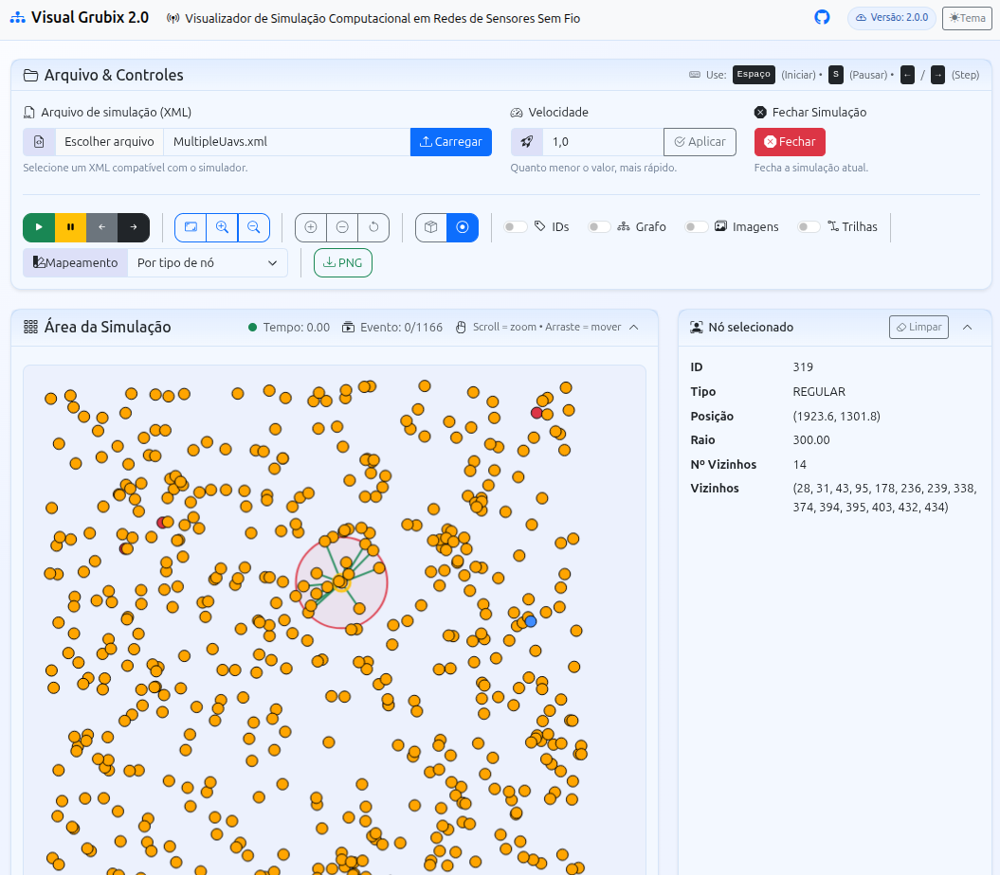

# VisualGrubix 2.0

Versão do [VisualGrubix](https://github.com/jesimar/VisualGrubix) para Web. O VisualGrubix é um visualizador de simulações em redes de sensores sem fio (RSSF). As simulações que podem ser visualizadas são oriundas do framework Grubix.

A versão web do VisualGrubix foi desenvolvida em Python com uso do *framework* Django. O frontend da aplicação utiliza HTML, CSS e JavaScript.

## Preparando o ambiente

Linux:

```bash
python3 -m venv venv
source venv/bin/activate
pip install -r requirements.txt
```

## Executando a aplicação

```bash
python manage.py runserver
```

Abra a aplicação no navegador: [http://127.0.0.1:8000/](http://127.0.0.1:8000/)

Uma tela semelhante a abaixo  deverá ser exibida.


